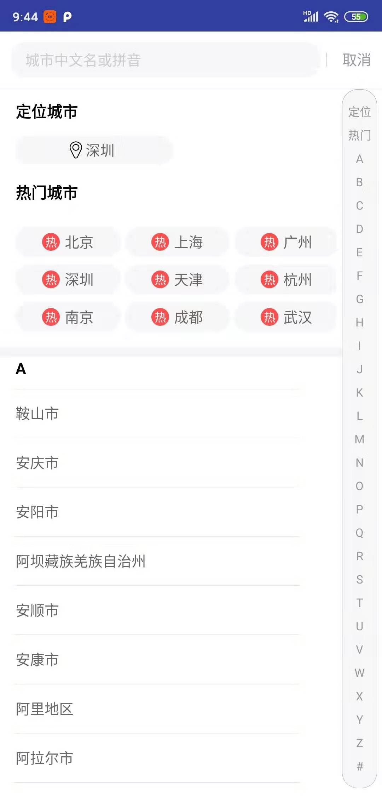

<p align="center">

</p>

# CityPicker

[](http://developer.android.com/index.html) [](https://android-arsenal.com/api?level=16)

#### How to use 使用方法：
如果有其它改进意见或想法可在issue中描述  
```
    implementation 'com.utils.cocoz:citypicker:0.1.0'
```  
```
   <dependency>
   	<groupId>com.utils.cocoz</groupId>
   	<artifactId>citypicker</artifactId>
   	<version>0.1.0</version>
   	<type>pom</type>
   </dependency>
```  
```
   <dependency org="com.utils.cocoz" name="citypicker" rev="0.1.0">
   	<artifact name="citypicker" ext="pom"></artifact>
   </dependency>
```  
[点击查看原文链接](https://github.com/zaaach/CityPicker)

#### 前言 ：
不再赘述，本只是搜到[原作者](https://github.com/zaaach)的框架，甚是喜欢，但发现有一些BUG，于是自己尽力修复了一些，为了方便和需求又添加了一些新的接口  
本打算自己留着用了，时间仓促，也没有太雕琢代码质量，单看到issue里有那么多问题，也不知道大家解决没有，但本着开源的原则，就把自己的版本发出来了  
原来整体代码还是比较好看懂的，我又加了一些简单的备注，如果可能建议还是多尝试着自己看一看  


#### 新增主要内容使用方法:  
```
    CityPicker.from(MainActivity.this)
                            // 设置动画及数据
                            .setAnimation(showAnim, anim)
                            // 设置定位及数据
                            .setLocatedCity(showLocation, new LocatedCity("北京", "北京", "110000"))
                            // 设置热门城市及数据
                            .setHotCities(showHot, null)
                            // 设置自定义列表数据
                            .setCustomData(showCustomList, getListData())
                            // 设置热门城市部分的显示
                            .setHotModel(strHotCityTitle, strHotCityTitleIcon)
                            .setOnPickListener(new OnPickListener() {
                                @Override
                                public void onPick(int position, City data) {
                                    currentTV.setText(String.format("当前城市：%s，%s", data.getName(), data.getCode()));
                                    Toast.makeText(
                                            getApplicationContext(),
                                            String.format("点击的数据：%s，%s", data.getName(), data.getCode()),
                                            Toast.LENGTH_SHORT)
                                            .show();
                                }
    
                                @Override
                                public void onCancel() {
                                    Toast.makeText(getApplicationContext(), "取消选择", Toast.LENGTH_SHORT).show();
                                }
    
                                @Override
                                public void onLocate() {
                                    //开始定位，这里模拟一下定位
                                    new Handler().postDelayed(new Runnable() {
                                        @Override
                                        public void run() {
                                            CityPicker.from(MainActivity.this).locateComplete(
                                                    new LocatedCity("深圳", "广东", "101280601"), LocateState.SUCCESS);
                                        }
                                    }, 3000);
                                }
                            })
                            .show();

```  
更多详细(如“如何修改颜色样式”)用法请[请查看原文链接](https://github.com/zaaach/CityPicker)

#### 主要修改：
-   新增可以配置是否开启“热门城市”
-   新增可以配置是否开启“定位”
-   开放接口自定义“热门城市”标题
-   开放接口自定义“热门城市”内容数据
-   修改数据库(现在数据库文件只包含市以上了)
-   修复“没有内容时还可以点击到城市”的BUG
-   修复“搜索不显示光标的BUG”
-   开放接口自定义城市数据
-   提升最低版本号为16
-   新增自动根据名称识别首字母，自定义数据一键排序

### 2020-7-18  v0.1.0
-   优化修改API配置调用方法
-   新增热门城市部分标题、图标内容修改
-   更新README文件

### 2020-1-15  v0.0.1
-   修改热门城市样式
-   微调字母标题字体
-   修改侧边字母导航栏样式
-   微调整体样式
-   开放了一些新的接口

### 什么样子的


[点击下载demo](https://fir.im/pyec)

样例代码中已经有详细的代码和备注，[点击查看样例代码](https://github.com/zhuxu1/CityPickerFixed/blob/master/sample/src/main/java/com/zaaach/citypickerdemo/MainActivity.java)


#### 
This is a fixed version, please click [here](https://github.com/zaaach/CityPicker) to see more  
If you need, you can submit an [issue](https://github.com/zhuxu1/CityPickerFixed/issues).  
如果有需要，可以提交iuuse     

####再次感谢原作者，希望帮助到更多的人

